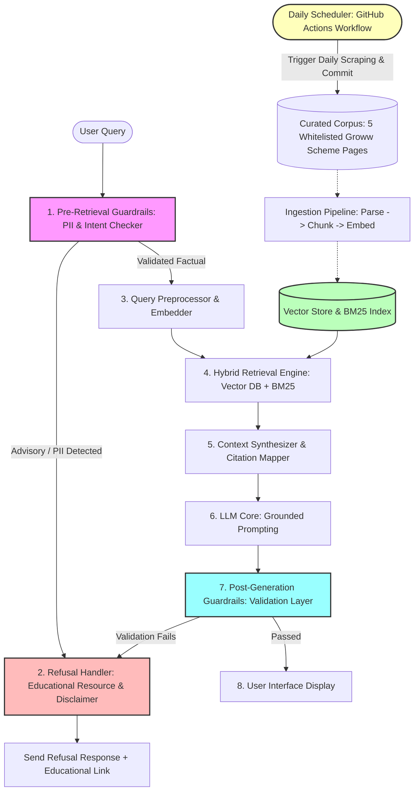

# Detailed System Architecture: Mutual Fund FAQ RAG Assistant

This document defines the production-grade, compliance-first system architecture for the facts-only Mutual Fund FAQ Assistant. The design leverages Retrieval-Augmented Generation (RAG) to provide verified, citation-backed answers to objective queries, with strict input-output validation layers.

---

## 1. Architectural Overview & Data Flow

The assistant operates as a closed-loop RAG system, combining dense semantic embeddings with sparse keyword matching. Heavy emphasizing is placed on two validation gates: the **Pre-Retrieval Guardrail** (detecting PII and subjective/advisory intents) and the **Post-Generation Validator** (enforcing formatting, domain whitelisting, and sentence count limit). To keep database documents fresh, a **Daily Ingestion Scheduler** triggers automatic scraping and embedding updates.



---

## 2. Technology Stack & Directory Structure

### A. Recommended Technology Stack
- **Frontend:** Vanilla HTML5, modern CSS3 (sleek dark mode, cards, glassmorphism, responsive grid), and asynchronous JavaScript.
- **Backend API:** Python 3.10+ with FastAPI (highly performant, asynchronous endpoints, auto-generated Swagger UI).
- **Orchestration Framework:** LangChain or LlamaIndex (for document loading, chunking, and memory management) or raw python SDKs (Groq SDK) for lean operations.
- **Vector Database:** ChromaDB or FAISS (local database instances for rapid configuration and zero cloud overhead).
- **Embedding Model:** BGE embedding model (e.g. `BAAI/bge-small-en-v1.5` or `BAAI/bge-large-en-v1.5` run locally or via API).
- **LLM Core:** Groq API (models like `llama-3.3-70b-versatile` or `mixtral-8x7b-32768` for sub-second, highly compliant response generation).
- **Scheduler Component:** GitHub Actions workflow running on a daily cron schedule to fetch latest data and commit updates.

### B. Project Directory Layout
```text
rag-faq-assistant/
├── .github/
│   └── workflows/
│       └── daily_ingest.yml       # GitHub Actions workflow for daily data scraping
├── backend/
│   ├── app/
│   │   ├── __init__.py
│   │   ├── main.py                # FastAPI main entrypoint
│   │   ├── config.py              # Environment variables & whitelists
│   │   ├── database.py            # ChromaDB initialization & setup
│   │   ├── guardrails.py          # Input PII & Intent parser
│   │   ├── orchestrator.py        # Core RAG retrieval & LLM pipeline
│   │   └── validator.py           # Output validation layer
│   ├── data/
│   │   ├── raw/                   # Downloaded raw Groww HTML pages
│   │   └── chroma/                # Persistent vector database files
│   ├── scripts/
│   │   └── ingest.py              # Ingestion & chunking pipeline runner
│   ├── requirements.txt           # Python dependency checklist
│   └── .env                       # Secrets, API keys
└── frontend/
    ├── index.html                 # Main Single Page App (SPA)
    ├── style.css                  # Modern CSS styling (glassmorphic cards, dark mode)
    └── app.js                     # Chat interface, AJAX polling, example query triggers
```

---

## 3. Database Schema & Chunk Metadata

Each ingested document is chunked and stored in the Vector database with strict metadata. This metadata is parsed during retrieval to form context-grounded source citations.

### Vector Store Payload Layout
```json
{
  "id": "chunk_sha256_hash",
  "text": "The HDFC Mid-Cap Opportunities Fund Direct Plan has an Exit Load of 1.00% if redeemed within 1 year from the date of allotment...",
  "metadata": {
    "scheme_name": "hdfc-mid-cap-opportunities-fund",
    "source_url": "https://groww.in/mutual-funds/hdfc-mid-cap-fund-direct-growth",
    "document_type": "groww_page",
    "last_updated": "2026-07-15",
    "section_title": "Pros & Cons / Exit Load"
  }
}
```

---

## 4. API Specification

The communication channel between the Frontend Chat Interface and the Backend RAG engine is standardized via a clean JSON payload.

### Endpoint: `POST /api/query`

#### Request Payload
```json
{
  "query": "What is the exit load for the HDFC Mid Cap Fund?"
}
```

#### Response Payload (Factual Query - Success)
```json
{
  "query": "What is the exit load for the HDFC Mid Cap Fund?",
  "answer": "The exit load for the HDFC Mid-Cap Opportunities Fund Direct Plan is 1.00% if shares are redeemed or switched out within one year from the date of allotment. No exit load is charged if redeemed after one year.",
  "citation_url": "https://groww.in/mutual-funds/hdfc-mid-cap-fund-direct-growth",
  "last_updated": "2026-07-15",
  "is_refusal": false,
  "execution_time_ms": 142
}
```

#### Response Payload (Advisory Query - Refusal)
```json
{
  "query": "Should I invest in HDFC Equity Fund direct growth?",
  "answer": "As a facts-only assistant, I am unable to provide investment advice, recommendations, or opinions on whether you should invest in a fund. For official guidance, please review the educational resources provided by SEBI or AMFI.",
  "citation_url": "https://www.amfiindia.com/investor-corner",
  "last_updated": "2026-07-15",
  "is_refusal": true,
  "execution_time_ms": 45
}
```

---

## 5. Detailed Phase-Wise Implementation Roadmap

### Phase 1: Corpus Collection & Data Ingestion
1. **Target Scheme Selection:**
   - **AMC:** HDFC Mutual Fund
   - **Target Schemes & Groww URLs:**
     - HDFC Mid-Cap Opportunities Fund: [HDFC Mid Cap Fund](https://groww.in/mutual-funds/hdfc-mid-cap-fund-direct-growth)
     - HDFC Flexi Cap Fund (formerly HDFC Equity Fund): [HDFC Equity Fund](https://groww.in/mutual-funds/hdfc-equity-fund-direct-growth)
     - HDFC Focused 30 Fund: [HDFC Focused Fund](https://groww.in/mutual-funds/hdfc-focused-fund-direct-growth)
     - HDFC ELSS Tax Saver: [HDFC ELSS Tax Saver Fund](https://groww.in/mutual-funds/hdfc-elss-tax-saver-fund-direct-plan-growth)
     - HDFC Large Cap Fund: [HDFC Large Cap Fund](https://groww.in/mutual-funds/hdfc-large-cap-fund-direct-growth)
2. **Scraping & Parsing:**
   - Develop scraping code in `scripts/ingest.py` using `BeautifulSoup` or `playwright` to download scheme metrics (Expense Ratio, Exit Load, Minimum SIP, Riskometer) directly from the Groww URLs.
3. **Chunking & Storage:**
   - Chunk size: ~500 characters, overlap: ~100 characters.
   - Insert embedded vectors into ChromaDB using a persistent storage path (`data/chroma`).

### Phase 2: Hybrid Search & Retrieval Setup
1. **Dense Retriever:** 
   - Embed queries using a BGE embedding model (e.g., `BAAI/bge-small-en-v1.5`) and calculate cosine similarity scores against local vector collections.
2. **Sparse Retriever (BM25):**
   - Build a lightweight `rank_bm25` index over all text chunks.
3. **Reciprocal Rank Fusion (RRF):**
   - Combine scores: $RRF\_Score(d) = \frac{1}{60 + rank_{vector}(d)} + \frac{1}{60 + rank_{BM25}(d)}$.
   - Retrieve top 3 chunks with high relevancy.

### Phase 3: Orchestrator & Guardrail Integration
1. **Input Guardrail:**
   - Regex scan for sensitive numerical matches (PAN cards: `[A-Z]{5}[0-9]{4}[A-Z]{1}`, Aadhaar cards: `^[2-9]{1}[0-9]{3}\\s[0-9]{4}\\s[0-9]{4}$`, mobile numbers, etc.).
   - Reject queries if inputs match.
2. **System Prompt Formulation:**
   - Define strict constraints to enforce:
     - No opinions or ratings (reject comparison words like "better", "best", "should I").
     - Output must use details in Context and quote the source URL.
3. **Refusal Mapping:**
   - Map rejected queries to a standardized database of educational links (e.g. SEBI Investor Education, AMFI portal).

### Phase 4: API & Modern UI Construction
1. **FastAPI Endpoints:**
   - Implement `POST /api/query` handling orchestrator interactions.
   - Support CORS for frontend integrations.
2. **Premium Frontend UI:**
   - Glassmorphic overlay cards, typography using *Inter* or *Outfit* from Google Fonts.
   - Dark theme enabled by default (deep blue-grey `#0B0F19` background, glowing green buttons `#10B981`).
   - Sticky top warning disclaimer card: **"Facts-only. No investment advice."**
   - Clickable bubble suggestions that instantly insert sample questions into the chat.

### Phase 5: Automated Ingestion via GitHub Actions Scheduler
1. **GitHub Actions Workflow Integration:**
   - Create a workflow file `.github/workflows/daily_ingest.yml` triggered on a daily cron schedule (at 10:30 AM IST / 5:00 AM UTC) and via manual dispatch (`workflow_dispatch`).
   - Configure the runner environment to check out the repository, setup Python, install required backend dependencies, and run the scraping script (`ingest.py`).
2. **Automated Content Commits:**
   - Conclude workflow by committing and pushing any changes in the raw corpus directory (`backend/data/raw/`) back to the repository.
3. **Database Re-indexing on Ingestion Updates:**
   - Enhance backend startup process (`startup_db_check` or a file-watcher loop) to detect if raw text files have updated timestamps or changed contents.
   - Automatically purge stale vector database records, chunk the updated files, re-embed, and reinitialize the BM25 search index dynamically without server disruption.

### Phase 6: Testing, Compliance & Validation
1. **Output Validator Script (`validator.py`):**
    - Verify sentence counts programmatically.
    - Validate citation URLs exist in the whitelisted domain list (`groww.in` specifically matching the 5 allowed URLs).
2. **Evaluation Suite:**
   - Run verification tests on a structured CSV of query inputs to assert accurate facts and robust refusals.

---

## 6. Key Security & Compliance Matrix

| Target Risk | Mitigation Logic | Resolution Path |
| :--- | :--- | :--- |
| **PII Data Leakage** | Regex + Substring matching on inputs | Return explicit block message; do not forward to LLM |
| **Advisory Input** | Intent classification + Zero-Shot prompt instruction | Redirect to polite refusal template with AMFI/SEBI links |
| **Hallucinated URLs** | Citation whitelisting checking matching allowed Groww URL list | Replace/suppress hallucinated URL with the specific whitelisted Groww URL |
| **Output Length Compliance**| Programmatic sentence-splitting checker | Truncate output or trigger regeneration with tighter temperature |
| **Out-of-Corpus Hallucinations** | Temperature set to 0.0 + Strict grounding instruction | Refuse query with: *"I am sorry, but the context does not contain this information."* |
